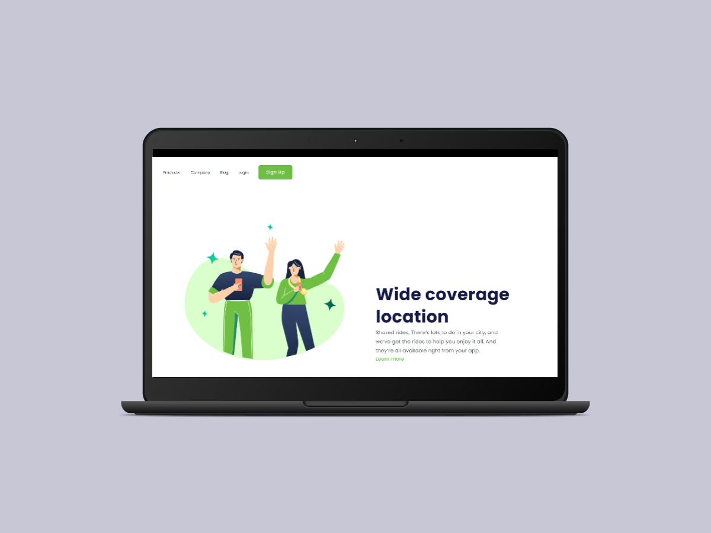
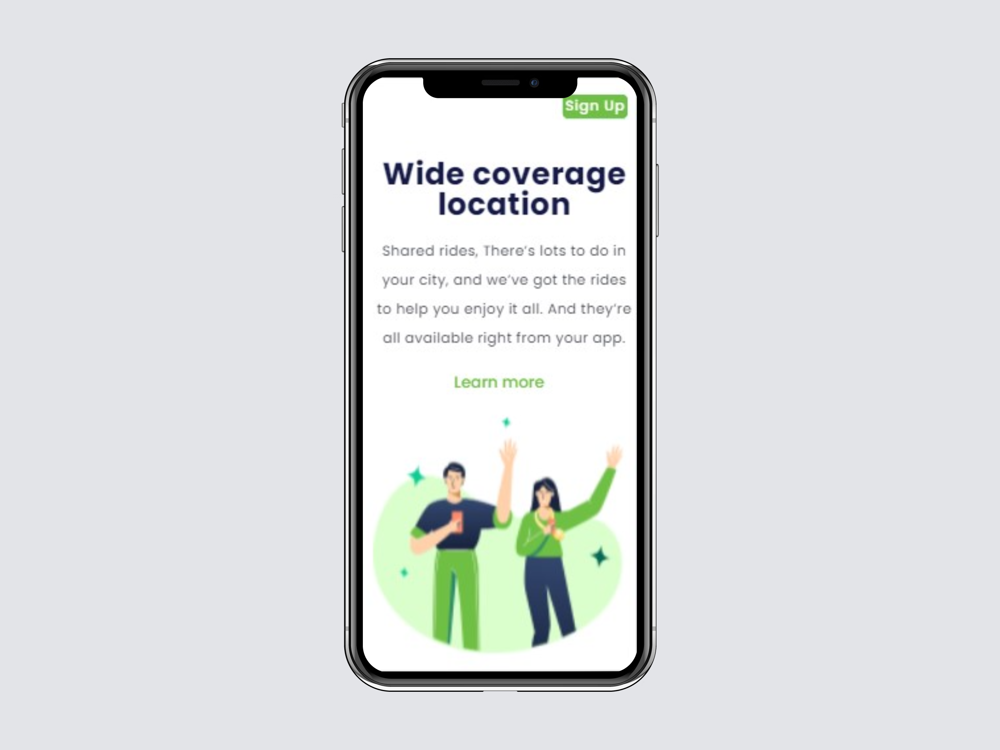

<h1 align="center"> Wide-coverage-location --- Responsive </h1>

 
 

<h4 align="center">Projeto de Homepage  responsiva em screens de dispositivos portáteis.</h4>
<h4 align="center">Baseada originalmente em uma estrutura para versão desktop, a página foi desenvolvida em exercício proposto em ambinete de aula e 
está configurada para se autoajustar à screen do dispositivo à qual for executada. Ou seja, à medida em que a tela do dispositivo cujo a qual a mesma for executada
for relativamente inferior à tela de um dispositivo desktop, a mesma tem seu conteúdo ajustado de forma que os elementos não se sobreponham uns aos outros. </h4>

 

<h2 align="center">Tecnologias utilizadas no Projeto:</h2>

 

 

 
  
 
<h2 align="center">Resultado:</h2>

<label> Versão Desktop</label>

<label> Versão Mobile</label>

 

<h2 align="center">Fase do Projeto:</h2>

 <b>Status do Projeto:</b> Concluido :heavy_check_mark:

